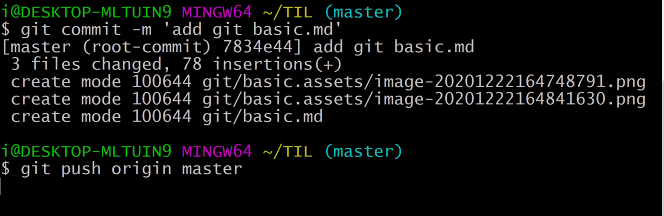

# Github - Git Basic


## git 이란?

- 버전관리 : 파일 변화를 시간에 따라 기록했다가 나중에 특정 시접의 버전을 다시 꺼내올 수 있는 시스템
  - 로컬 버전 관리(VSC) / 중앙집중식 버전관리(CVCS)  / 분산버전 관리 시스템(DVCS)
- Git은 DVCS 환경 : 리모트 저장소가 존재함. 따라서 동시에 다양한 그룹과 협업할 수 있음. 워크플로를 다양하게 사용할 수 있음.


## git 설치

1. git-scm.com 에서 다운로드
2. 계속 next 로 설치


## git 사용법

#### 0. 최초설정

- 로그인 : 처음 컴퓨터에 git을 설치하면, 사용자의 이메일과 이름을 적어줌. 이는 앞으로 일어나는 커밋에 서명을 하기 위해서 필요함.

```
$ git config --global user.name "<당신의 이름>"
$ git config --global user.email "<당신의>@<이메일>"
```

- 설정 확인

```
$ git config user.name
이름 출력
$ git config user.email
이메일 출력
```
- 기본 명령어(git bash)

| 명령어                       | 설명                             |
| ---------------------------- | -------------------------------- |
| `$ mkdir <name1, name2 ...>` | 폴더 생성(make directory)        |
| `$ touch <name>`             | 파일 생성                        |
| `$ cd <directory>`           | 디렉토리 설정                    |
| `$ cd ..` = `$ cd ~`         | 위로가기 / 홈으로 가기           |
| `$ls` / `$ ls -a`            | 목록 확인 / 숨겨진 폴더까지 확인 |
| `$ rm -r <name>`             | 해당 파일/폴더 삭제              |
| `$ rm -rf .git`              | 초기화(강제로 전부)              |


#### 1. git 저장소 만들기

- init(초기화, 저장소 생성) : 초기화는 `git init` 을 통해 진행한다. (git 저장소 = version 관리 = repo), master(project 시작할 때)

  ```
  $ git init
  ```

- add(파일추가) : stage에 올림/등록, 변동사항이 있는 경우 stage에 올려 commit하기 위함

  ```
  $ git add <파일명>   # 특정 파일만 추가
  $ git add . / (-A) # 변경사항이 있는 모두를 찾아서 추가함
  ```

- commit

  ```
  $ git commit
  $ git commit -m 'name'
  
  $ git commit --amend  # commit message 변경(최근 것만 해당)
  ```

  

#### 2. 수정 후 저장소에 저장

- 워킹디렉토리 - Tracked(관리대상) / Untracked(비관리대상)
  - Tracked : 이미 스냅샷에 포함된 파일. 즉 Git이 알고 있는 파일(Unmodified(수정하지 않음), Modified(수정함), Staged(커밋으로 저장소에 기록))
  - Untracked : Staging Area에 포함되지 않은 파일. 파일을 checkout한 후 아무것도 수정하지 않았기 때문

- 파일 상태 확인

  ```
  $ git status
  ```

- 파일 무시하기: 보통 로그 파일, 빌드 시스템이 자동으로 생성한 파일은 git이 관리할 필요가 없음.

  ```
  $ .gitignore    # 파일을 만들고 그 안에 무시할 파일 패턴을 작성
  ```

- 파일 삭제하기 :  Git 에서 파일 제거. Tracked 상태의 파일을 삭제 - 커밋

  ```
  $ git rm
  ```

- 파일 이름 변경

  ```
  $ git mv file(from) file(to)
  ```

- 파일 복원 : 워킹 트리의 파일을 복원해 주는 역할

  ```
  $ git restore <filen ame>
  ```


#### 3. Commit History

- log : 커밋 히스토리 조회

  ```
  $ git log
  ```


#### 4. Remote(원격)저장소 등록

- 리모트 저장소를 관리하며 데이터를 push, pull하는 것

- 리모트 저장소를 관리하는 것은 저장소를 추가, 삭제. 브랜치를 관리하고 추적할지 말지 등을 관리

- remote 저장소 확인

  ```
  $ git remote -v  # remote 저장소의 단축이름과 URL을 함께 확인
  origin <URL>...   # origin remote 저장소의 이름
  ```

- remote 저장소 추가

  ```
  $ git remote add origin <URL>  # 저장소 추가
  ```

- remote 저장소에 Push

  ```
  $ git push origin master  # remote 이름이 origin일 경우에 master 브랜치를 push함
  ```

  

- remote 저장소 삭제

  ```
  $ git remote rm <remote_repo_name>
  ```

  

## Summary

| 명령어                             | 설명                                          |
| ---------------------------------- | --------------------------------------------- |
| `$ git init`                       | 빈 디렉토리(폴더)를 git 저장소(repo)로 초기화 |
| `$ git add <filename>`             | `<filename>`을 Stage 에 올림                  |
| `$ git commit -m "commit message"` | 커밋함                                        |
| `$ git status`                     | 파일 상태 확인                                |
| `$ git log`                        | 커밋 히스토리 조회                            |
| ` $ git remote -v`                 | remote 저장소 확인                            |
| `$ git remote add origin <url>`    | remote 저장소 추가                            |
| `$ git push origin master`         | remote 저장소에 push                          |


